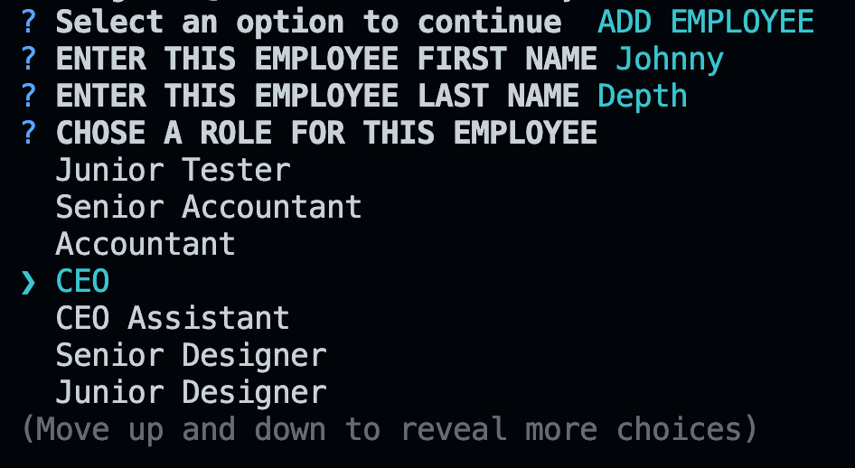

# EXPLORE SPACEX DATABASE - MySQL

#### Resources

[Github Repository](https://github.com/Truecoding4life/MySQL-for-SPACEX)

---

### Description 
Our JavaScript and MySQL-powered application offers users the power to explore SpaceX Corporation's extensive database. Dive into the universe of space exploration, effortlessly navigate and manage the database, and have the ability to make impactful changes to the data, keeping you in the loop with the latest developments in the exciting world of space technology and innovation.

-------------

#### Table of Contents

* [Resources](#resources)
* [Features](#features)
* [Installation](#installation)
* [Usage](#usage)
* [Technology Used](#technologies-used)

## Features

#### Explore Department, Employee and Role

*View of all employees*

---

#### Add New Employee
*User Don't have to enter a role ID for this employee, instead all the role available will be come a selection.*

---

#### Update Employee Role

*User don't have to enter the employee ID to change their role, instead they just select which employee from the list*

---

#### Salary input is not forgiven for alphabetic.

*User only allow to enter number into salary input field. This will prevent the problem of typo when setting salary.*

---

### Installation
1. Download zip-file
2. Open zip and extract file
3. Open file path in terminal 
4. To start up the application type in the command line
  
    node server.js

5. You then could explore the database of Space X;

---

### Usage
The SpaceX Database application is your all-in-one solution for seamless data management and exploration. With a user-friendly interface and dynamic role management, it simplifies the process of keeping your database accurate and up to date, ensuring you're always in the know about the incredible work happening in the world of space technology and innovation.

Explore, update, and manage your SpaceX database with confidence, all thanks to the power of MySQL and JavaScript.

---

### Technologies used
- Inquirer NPM Packages
- MySQL2 NPM Packages
- MySQL
- Javascript

---

##### This README was generated based on the Good README Guide

---

This Application is made available by Jay's Studio © 
